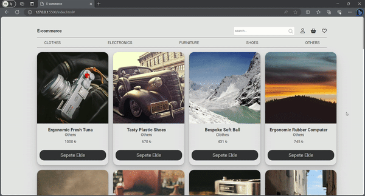

<h1>E-Commerce-Project</h1>

This project contains a JavaScript-built example of a simple e-commerce application. Below you can find the main features of the project:
- Pulling categories and products from the API
- Adding and removing products to the cart
- Displaying cart contents and calculating the total price
- Responsive interface design

<h3>The website was developed using the following technologies:</h3>

HTML
CSS
Javascript

